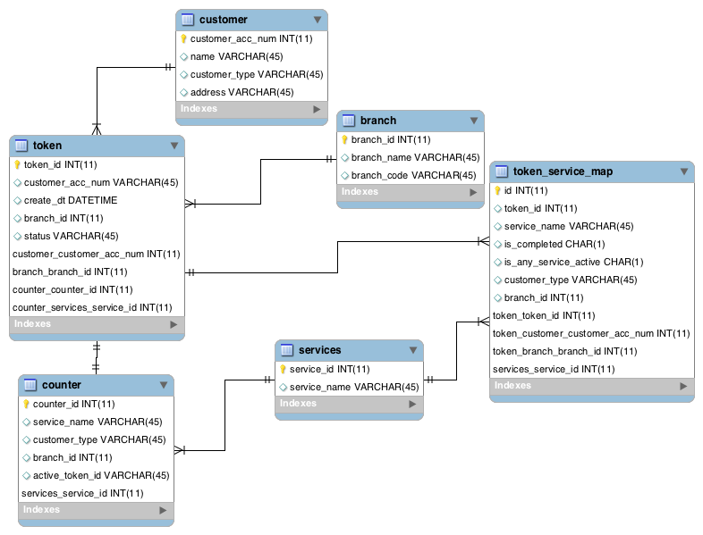

# bank-queue-management

Provide API to manage queue in different branches of ABC bank .

**Tech Stack :**

* Spring Boot 1.5.9
* java 1.8
* Mysql 5.7.21
* RabbitMQ 3.7.5

**Prerequisite:**

* Java 1.8 or higher
* Maven 3.3.9
* Mysql 5.7
* RabbitMQ 3.7

## Assumptions:
* Bank is having multiple branches with existing customers and some new customers. Services offered by branch is availed at specific counters and PREMIUM account holders have special counters for each those services.
* Token will be generated for each service requested by customer and will be picked by counter based on availability.
* Existing customers can be services directly on the basis of service requests they are asking for.
* For new customer, account will be created first, and then other services will be processed based on requests.
* Multiple requests can processed in chain automatically one after the other based on token status at each service counter.

## Entity Relationship Diagram :




## Rest API :
1. **URL : /api/customer**

 **Method :** POST

 **Response** Customer detail json

 **Request Body**
```json
 {
		"accountNumber": "234567",
		"name": "Kunal",
		"customerType": "REGULAR",
		"address": "Hitech"
}
```
 This API Registers Customer to system .

2.**URL : /api/customer/{customerId}**

 **Method :** GET

 **Response** Customer detail json

 This API is to get customer detail for given customer id.

 3.**URL : /api/service/register**

 **Method :** GET

 **Response** Success Message

 This API is to register multiple queues to rabbit mq based on services-customerType-branchId combination .
 This also attach listener with queues .

 4.**URL : /api/branch**

 **Method :** POST

 **Response** Branch detail json

 **Request Body**
```json
 {
		"branchName": "PUNE",
		"branchCode": "PUN"
}
```
 This API Registers branch to system .

 5.**URL : /api/counter**

 **Method :** POST

 **Response** Counter detail json

 **Request Body**
```json
 {
		"serviceName": "LOAN",
		"customerType": "REGULAR",
    "branchId": "1"
}
```
 This API Registers Counter to system .

 6.**URL : /api/service**

 **Method :** POST

 **Response** Services detail json

 **Request Body**
```json
 {
		"serviceName": "LOAN"
}
```
 This API Registers Counter to system .

 7.**URL : /api/token/**

  **Method :** POST

  **Response** Token Detail json

  **Request Body**
```json
  {
		"accountNumber": "12345",
		"servicesList": ["BANKING","DEPOSIT","WITHDRAWL"],
		"branchId": "1"
}
```
  This API Register create token and then send to queue which altimately picked by some available counter.

8.**URL : /api/counter/nextToken/{counterId}**

 **Method :** GET

 **Response** Token Id.

Next token to be served in the queue for given service, customer type and branch.

9.**URL : /api/counter/markComplete/{counterId}/{tokenId}**

  **Method :** PUT

  **Response** Success Message : Status OK

  This API mark current service completed and if no next service available for same token then close it.

10.**URL : /api/counter/moveNext**

  **Method :** PUT

    **Request Body**
```json
  {
	"tokenId" : "28",
	"counterId" : "5",
	"nextServiceName" : "KYC"
  }
```
  **Response** Success Message : Status OK

  This API Assign the next step service to the current token and queue it .

  11.**URL : /counter/{branchId}**

 **Method :** GET

 **Response** counter detail for given branch.

 12.**URL : /token/pending/{branchId}**

**Method :** GET

**Response** provide all tokens which are in waiting state.

This API get the all counters belong to given branch and current active token on that.
